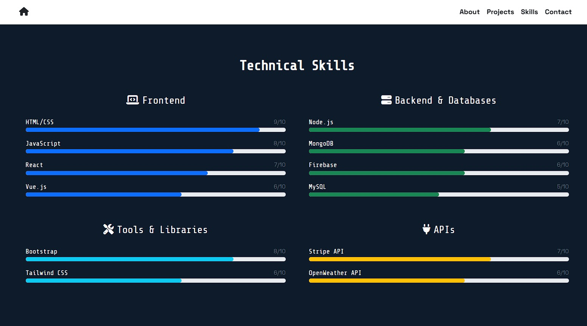

# 🚀 **Portfolio Website**

**Live Demo:** [https://sherwinpaga.github.io/finalsPAGA/](https://sherwinpaga.github.io/finalsPAGA/)

---

## 📸 **Screenshot Gallery**

### **1. Hero Section**

  
_Blue gradient with bold typography and CTA button_

### **2. Projects Showcase**

  
_Card-based layout with modal popup triggers_

### **3. Skills Section**

  
_Visual skill meters with technology badges_

---

## 🎨 **Design Choices**

### **Visual Identity**

- **Color Scheme**:
  - `White header/footer` with `dark text` for maximum readability
  - `Blue gradient hero section` for tech-inspired vibrancy
- **Typography**:
  - Terminal-like monospace headings (`Share Tech Mono`)
  - Clean sans-serif body text (`Space Grotesk`)

### **Interactive Elements**

| Feature                | Purpose                                  |
| ---------------------- | ---------------------------------------- |
| Collapsible navbar     | Mobile-friendly navigation               |
| Project carousel       | Showcase work without clutter            |
| Skill proficiency bars | Visualize competencies at a glance       |
| 404 redirect button    | Playful error page for "Live Demo" links |

---

## 🗂 **Content Organization**

### **Hierarchical Flow**

1. **Hero Section**
   - Immediate impact with name and purpose
2. **About**
   - Personal introduction and mission
3. **Projects**
   - Interactive carousel with modal details
4. **Skills**
   - Visual sliders for technical proficiencies
5. **Contact**
   - Clear call-to-action

### **Key UX Decisions**

- ✅ **Whitespace-heavy layout** → Reduces cognitive load
- ✅ **Card-based design** → Consistent visual language
- ✅ **Smooth scroll behavior** → Seamless navigation

---

## 🛠 **Technical Highlights**

---

## 🔗 **Quick Links**

- [View Live Portfolio](https://sherwinpaga.github.io/finalsPAGA/)
- [GitHub Repository](https://github.com/sherwinPAGA/finalsPAGA)

---

This version uses:

- **Emojis** for visual scanning
- **Tables** to compare features
- **Mermaid diagram** for technical stack
- **Bold/Cursive** for emphasis
- **Clean headers** with dividers
